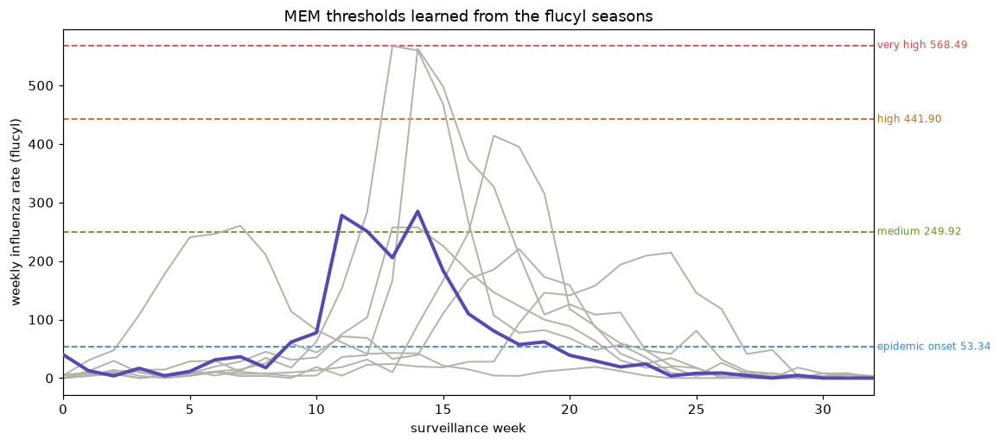

# epimem

A Python port of the core Moving Epidemic Method (MEM) from the R package
[`lozalojo/mem`](https://github.com/lozalojo/mem) by José E. Lozano.

MEM learns warning thresholds for a weekly seasonal indicator (for example, influenza incidence
rates) from past complete seasons: an epidemic-onset line, plus three intensity lines (medium, high,
very high). Each new week is then graded against them. MEM is unit-agnostic: it accepts any weekly
indicator (a rate per 100,000, a percent share, a raw count), and the thresholds come out in that
same unit. This port also includes the auto-tuner and the surveillance companion functions.

| Function | What it does |
|---|---|
| `mem_model` | the epidemic-onset and intensity thresholds (the core) |
| `mem_intensity` | the four cut-points, labelled (`Epidemic`, `Medium (40%)`, and so on) |
| `mem_trend` | a rising or falling signal from week-over-week changes |
| `mem_goodness` | how good a setting is, by leave-one-season-out cross-validation |
| `roc_analysis` | the auto-tuner: sweep the slope and pick the best value for the seasons |
| `optimum_by_inspection` | tune the slope against analyst-marked epidemics |
| `mem_stability` | how much the thresholds move as seasons accumulate |
| `mem_evolution` | how the thresholds would have looked season by season (real-time, or leave-one-out) |

Each function reproduces R `mem` on its own `flucyl` data, the core thresholds to machine precision
(see Fidelity below).

> Not affiliated with or endorsed by the original author. This is an independent re-implementation
> for use where R is not available.

## Install

Needs Python 3.11 or later. From a clone of this repo:

```bash
pip install -e .            # core: numpy + scipy only
pip install -e ".[plot]"    # adds matplotlib, for the chart
```

The core depends only on `numpy` and `scipy`. Charting (`epimem.plot`) is an optional extra.

## Quickstart

```python
from epimem import mem_model, example_seasons

# Bundled demo data, so this runs as-is: 8 past influenza seasons of weekly ILI rates
# (cases per 100,000), from R mem's flucyl. Any 2-D array works in its place, shaped
# the same way: one column per season, one row per week.
season_matrix = example_seasons()
print(season_matrix.shape)                   # (33, 8): 33 weeks, 8 seasons

model = mem_model(season_matrix)             # build the thresholds
print(model.epidemic_onset)                  # the "season has started" line (~53 cases/100k here)
print(model.medium, model.high, model.very_high)

# Grade a week. Returns one of: 'baseline', 'low (epidemic started)', 'medium',
# 'high', 'very high', 'no data'.
print(model.level_of(300.0))                 # -> 'medium'
```

`roc_analysis` can pick the detection slope from the seasons, and `mem_trend` gives a trend signal:

```python
from epimem import roc_analysis, mem_trend

# Tuning needs 6+ seasons; the demo data has 8.
tuning = roc_analysis(season_matrix)
best_slope = tuning.best("youden")                 # slope that best balances hits vs false alarms
model = mem_model(season_matrix, param=best_slope) # refit with it (the default is 2.8)

# Rising / falling cut-offs from week-to-week changes:
trend = mem_trend(season_matrix)
trend.ascending, trend.descending
```

## Plotting (optional)

With the `plot` extra installed (`pip install -e ".[plot]"`), `mem_chart` draws the standard MEM
chart: past seasons in grey, the current one in bold, with the threshold lines.

```python
from epimem import mem_model
from epimem.plot import mem_chart

model = mem_model(season_matrix)
ax = mem_chart(season_matrix, model, ylabel="weekly influenza rate")
ax.figure.savefig("mem.svg")
```

matplotlib is imported lazily, so the core package never requires it.

## Worked example: the bundled `flucyl` data

`flucyl` is R `mem`'s own example dataset: weekly influenza-like-illness rates (cases per 100,000
inhabitants), Castilla y León, 33 weeks by 8 seasons. It ships with this package as
`example_seasons()`. Learning the thresholds from its eight seasons and drawing them with
`mem_chart` gives:



The grey lines are the eight past seasons. The dashed lines are the four thresholds:

| line | rate (per 100,000) | how to read it |
|---|---|---|
| epidemic onset | 53 | above this, the season has started |
| medium | 250 | a typical epidemic week |
| high | 442 | a strong week |
| very high | 569 | as bad as the worst past seasons |

A live season is graded by passing each week's value to `model.level_of(value)`: it returns
`baseline` until the value crosses 53 (onset), then `low (epidemic started)`, `medium`, `high`,
`very high` as it climbs.

## Parameters (same names and defaults as R `memmodel`)

| Python (`mem_model`) | R (`memmodel`) | Default | Meaning |
|---|---|---|---|
| `method` | `i.method` | 2 | optimum method (only 2, the criterion, is ported) |
| `param` | `i.param` | 2.8 | how steep the week-over-week rise must be to call onset; higher is stricter (later onset) |
| `n_values` | `i.n.max` | `round(30/n_seasons)` | how many top weeks per season feed the threshold pools (~30 in all); rarely changed |
| `type_threshold` | `i.type.threshold` | 5 | onset interval: arithmetic prediction |
| `level_threshold` | `i.level.threshold` | 0.95 | onset confidence level |
| `tails_threshold` | `i.tails.threshold` | 1 | one-sided |
| `type_intensity` | `i.type.intensity` | 6 | intensity interval: geometric prediction |
| `level_intensity` | `i.level.intensity` | (0.40, 0.90, 0.975) | medium / high / very-high levels |
| `tails_intensity` | `i.tails.intensity` | 1 | one-sided |
| `use_t` | `i.use.t` | False | t vs normal quantiles |

Confidence-interval types match R: 1 = arithmetic mean, 2 = geometric mean, 3 = nonparametric
median (two-sided), 5 = arithmetic prediction, 6 = geometric prediction.

## Fidelity and limitations

Verified against R. Every function above was run in both the R original and this port on the
package's own `flucyl` data and the numbers compared: `mem_model`, `mem_goodness`, the `roc_analysis`
and `optimum_by_inspection` sweeps, `mem_intensity`, `mem_trend`, and the `mem_stability` and
`mem_evolution` thresholds. The clean thresholds match to machine precision; the gap-filled
thresholds (where R and numpy round the missing-week fill slightly differently) and the
cross-validated scores match to about one part in a million. The checks are in
`tests/test_equivalence.py`; the R-generated reference numbers are in `tests/reference/`, each with
the `generate_*.R` script that produced it.

Ported faithfully: the mean, prediction, and geometric confidence intervals, the MAP curve, the
slope-criterion optimum, per-season timing, cross-season pooling, the leave-one-season-out goodness
metrics, the kernel smoother and its bandwidth selection (`sm.regression` and `h.select`'s df=6
rule), and the rank-based tuner.

Simpler than R in one place: the median confidence interval (type 3) uses the standard
order-statistic (sign-test) interval instead of R's interpolated one. It feeds only the typical
duration, start-week, and percent-covered summary, so those numbers do not match R to the last
digit; the thresholds themselves do.

Not ported, by choice:

- The R plotting functions (`memsurveillance`, `full.series.graph`, `processPlots`).
  `epimem.plot.mem_chart` draws the standard chart instead.
- The data-reshaping helpers (`transformdata`, `transformseries`). epimem takes a ready numpy matrix.
- The `flucylraw` raw dataset and the deprecated `epimem` and `epitiming` functions.
- Confidence-interval type 4 (bootstrap): it cannot be reproduced exactly against R's random-number
  stream, and no default uses it (`confidence_interval` raises a clear error if it is requested).
  Also the one-sided median interval, optimum methods 1, 3, and 4, and the modelled typical curve.

## Reference

Vega T, Lozano JE, Meerhoff T, et al. *Influenza surveillance in Europe: establishing
epidemic thresholds by the moving epidemic method.* Influenza Other Respir Viruses. 2013;7(4):546-58.
Original R package: https://github.com/lozalojo/mem
